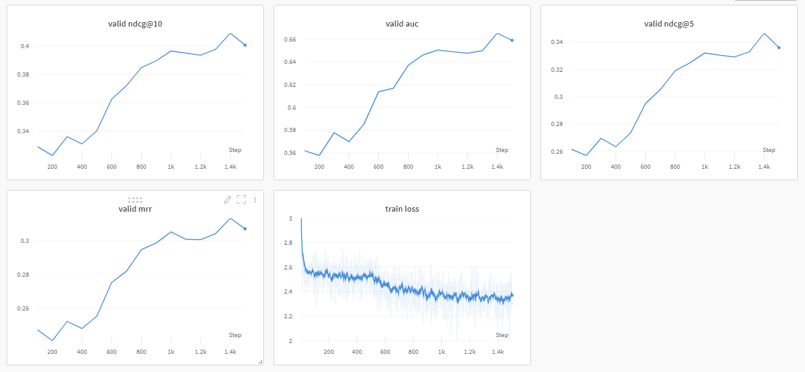

# Efficient-FedRec
Python implementation for our paper "Efficient-FedRec: Efficient Federated Learning Frameworkfor Privacy-Preserving News Recommendation" in EMNLP 2021.

## Introduction
Directly applying federated learning on news recommendation models will lead to high computation and communication cost on user side.
In this work, we propose Efficient-FedRec, in which we dicompose the news recommendation model into a large news model maintained on server and a light-weight user model computed on the user side.
Experiments on two public dataset show the effectiveness of our method.


## Environment
pip install -r requirements.txt
```
numpy
torch
transformers
tqdm
sklearn
wandb
```

## Getting Started
* Download datasets 
```bash
cd raw
chmod +x download.sh
./download.show
```
* Preprocess datasets 
```bash
cd preprocess
# modify adressa to mind format
python adressa_raw.py

# preprocess mind dataset
python news_process.py --data mind
python user_process.py --data mind

# preprocess adressa dataset
python news_process.py --data adressa
python user_process.py --data adressa
```

* Run experiments
```bash
# You may need to configure your wandb account first
cd src
python main.py --data mind
python main.py --data adressa
```


## Results
Wandb result on MIND dataset (validation results, need to upload prediction results to condalab for test results )


## Citing
If you want to cite Efficient-Fedrec in your papers (much appreciated!), you can cite it as follows:
```
@inproceedings{yi-etal-2021-efficient,
    title = "Efficient-{F}ed{R}ec: Efficient Federated Learning Framework for Privacy-Preserving News Recommendation",
    author = "Yi, Jingwei  and
      Wu, Fangzhao  and
      Wu, Chuhan  and
      Liu, Ruixuan  and
      Sun, Guangzhong  and
      Xie, Xing",
    booktitle = "EMNLP",
    year = "2021",
    pages = "2814--2824"
}
```
